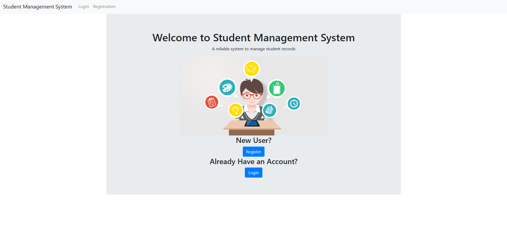
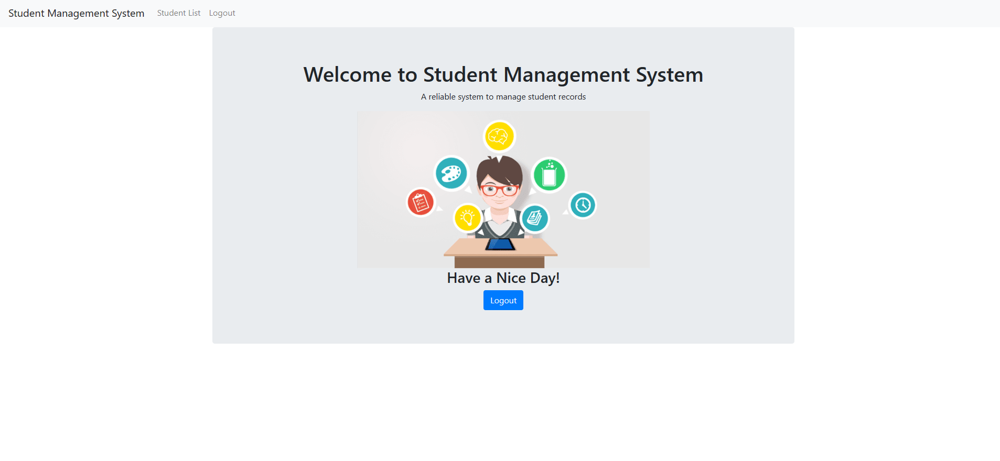
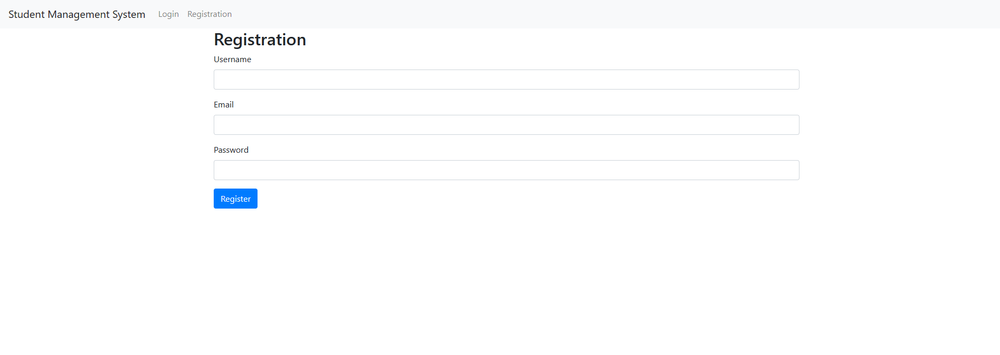
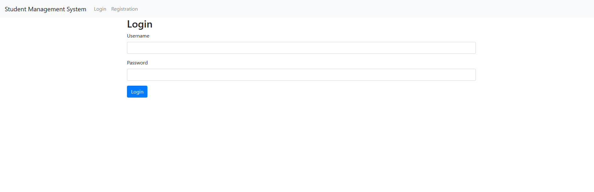
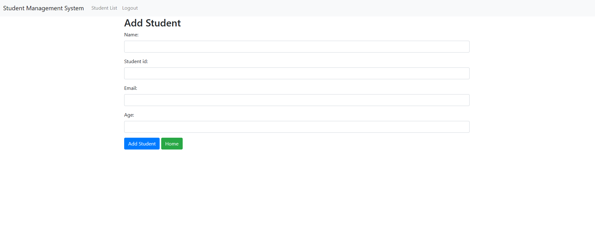
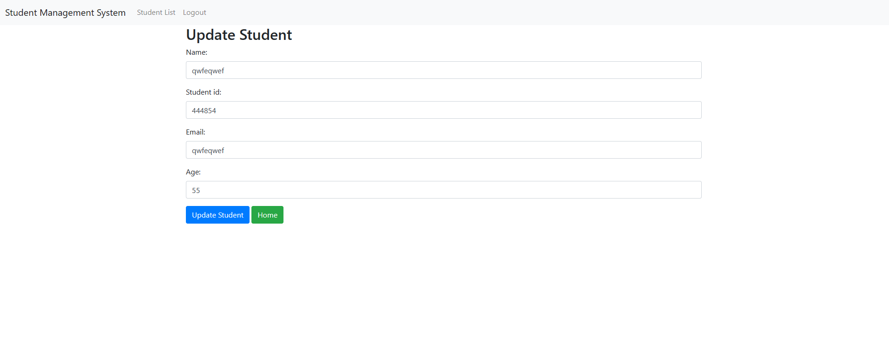
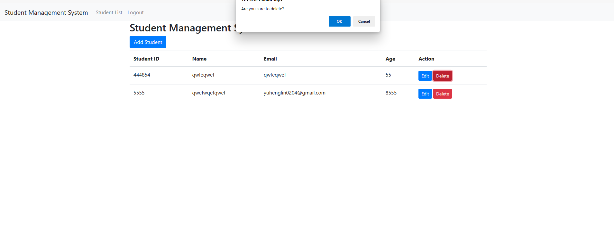

# Student Management System
A student management system built in django and sqlite, it supports basic crud with login/out, and registration functionalities.
The system can only be used by authenticated users.

## Demo
* New User Homepage
    
* Logged In User Homepage
    
* Registration For New Users
    
* Login
    
* Add a new Student
    
* Update a Student's Info
    
* Delete an Existing Student
    

## System Setup

To run this project run the command 'pip install -r requirements.txt'
